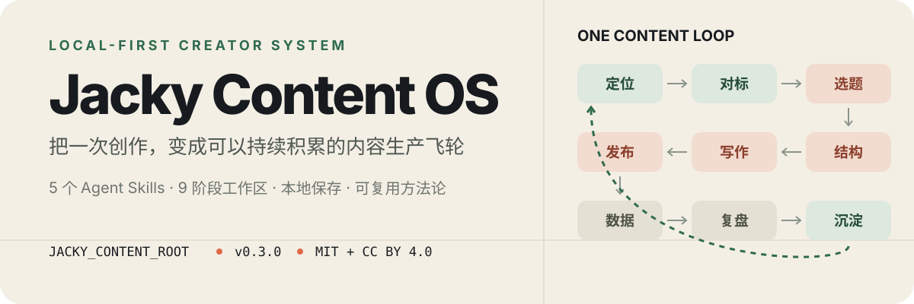

<p align="center">
  
</p>

Jacky Content OS 是一套给内容创作者、个人 IP 和一人公司的本地内容生产系统。它把 Agent Skills、方法论模板和长期工作区连成一条可重复的生产线：不只帮你写一篇稿，而是让每次创作都为下一次积累素材、数据和判断。

> **一句话理解：** 一个主流程 Skill、四个专项 Skill，加上一套九阶段本地工作区模板。

## 60 秒开始

### 1. 安装 Skills

```bash
npx skills add Jackywxsz/Jacky-Content-OS
```

也可以只复制需要的 Skill：

```bash
cp -R skills/jacky-content ~/.codex/skills/
cp -R skills/jacky-hook ~/.codex/skills/
cp -R skills/jacky-wiki ~/.codex/skills/
cp -R skills/jacky-de-ai ~/.codex/skills/
cp -R skills/jacky-xhs-check ~/.codex/skills/
```

### 2. 建立内容工作区

复制 [`jacky-content-system-template/`](./jacky-content-system-template/README.md)，改名为自己的 `Jacky Content System`，再配置路径：

```bash
export JACKY_CONTENT_ROOT="$HOME/Documents/Jacky Content System"
export WIKI_ROOT="$HOME/Documents/知识库"
```

### 3. 从一个真实选题开始

```text
使用 $jacky-content，把「为什么用了 AI 反而更忙」发展成一条短视频。
```

主 Skill 会依次读取你的用户画像、对标账号、个人上下文和历史选题，再进入调研、结构、写作、发布与复盘。

## 你会得到什么

| 入口 | 解决的问题 | 最适合的时机 |
| --- | --- | --- |
| [`jacky-content`](./skills/jacky-content/SKILL.md) | 串起完整内容生产流程 | 从选题一路做到发布和复盘 |
| [`jacky-hook`](./skills/jacky-hook/SKILL.md) | 诊断并重写开头 | 前几秒留不住人、开场太平 |
| [`jacky-wiki`](./skills/jacky-wiki/SKILL.md) | 检索和沉淀个人知识 | 把对话、素材和经验变成长效资产 |
| [`jacky-de-ai`](./skills/jacky-de-ai/SKILL.md) | 去掉模板感和机器味 | 初稿太书面、太顺滑、缺少真人判断 |
| [`jacky-xhs-check`](./skills/jacky-xhs-check/SKILL.md) | 做发布前风险检查 | 小红书文案上线前检查敏感表达 |

## 从一篇内容变成生产飞轮

```text
定位 → 对标 → 选题 → 结构 → 写作 → 发布 → 数据 → 复盘 → 沉淀
  ↑                                                       ↓
  └────────────────── 下一轮读取已有判断与资产 ────────────┘
```

系统的核心不是“多生成几篇稿”，而是让四类资产持续增长：

- **创作上下文**：你的经历、判断、口头表达和受众认知。
- **选题资产**：谜题、非共识、对标观察和待发布方向。
- **内容资产**：稿件、发布记录、案例和结构模板。
- **反馈资产**：数据复盘、失败经验和已经验证的方法。

详细方法见 [`docs/production-flywheel.md`](./docs/production-flywheel.md) 与 [`docs/topic-system.md`](./docs/topic-system.md)。

## 本地工作区长什么样

```text
Jacky Content System/
├── 01.用户画像/      # 写给谁
├── 02.对标账号/      # 向谁学习、避开什么
├── 03.我的上下文/    # 只有你能提供的经历与判断
├── 04.选题决策/      # 谜题、非共识与选题池
├── 05.文案结构/      # 可验证的表达框架
├── 06.开篇模板/      # 故事、知识、过程与观点开头
├── 07.发布存档/      # 待发布和已发布内容
├── 08.数据反馈/      # 单条与月度复盘
├── 09.经验沉淀/      # 方法论、词典与失败经验
└── CLAUDE.md         # 人设、受众和写作硬标准
```

模板来自真实工作流的脱敏版本。你可以放在 Obsidian 或普通文件夹中；脚本只通过 `JACKY_CONTENT_ROOT` 定位，不依赖固定的本机路径。

## 项目结构

```text
Jacky-Content-OS/
├── skills/                         # 5 个可独立安装的 Agent Skills
├── jacky-content-system-template/  # 九阶段内容工作区模板
├── docs/                           # 安装、选题、复盘与生产飞轮说明
├── tests/                          # 发布契约与脚本安全检查
├── LICENSE                         # 脚本与代码：MIT
└── LICENSE-DOCS.md                 # 文档与模板：CC BY 4.0
```

## 边界与隐私

这个仓库提供公开的 Skill、脚本、结构和空白方法论模板，不包含你的真实稿件、账号数据、私有对标、收入信息或本机绝对路径。

- 所有个人内容默认留在你自己的工作区。
- 不需要把 API Key、Token 或账号凭据写入仓库。
- 写入脚本不会覆盖已有的同名内容文件。
- 发布前建议阅读 [`SECURITY.md`](./SECURITY.md) 与 [`LICENSE-DOCS.md`](./LICENSE-DOCS.md)。

## 相关项目

- [`Jacky-Cockpit`](https://github.com/Jackywxsz/Jacky-Cockpit)：把内容阶段、排期、目标和复盘放进本地可视化驾驶舱。
- [`Jacky-motion`](https://github.com/Jackywxsz/Jacky-motion)：把中文口播稿转成可录屏的信息动画。
- [`Jacky-illustration`](https://github.com/Jackywxsz/Jacky-illustration)：为文章、教程和观点生成统一的信息视觉。

## 进一步学习

如果你希望把这套方法扩展成完整的个人内容业务，可以查看我的[创作者 AI 课与答疑群](https://mp.weixin.qq.com/s/x924y3O9-nWda5OTHArKKg)。

<a href="https://mp.weixin.qq.com/s/x924y3O9-nWda5OTHArKKg">
  
</a>

## 许可证

- 脚本和代码：[MIT](./LICENSE)
- 文档、模板和方法论：[CC BY 4.0](./LICENSE-DOCS.md)
